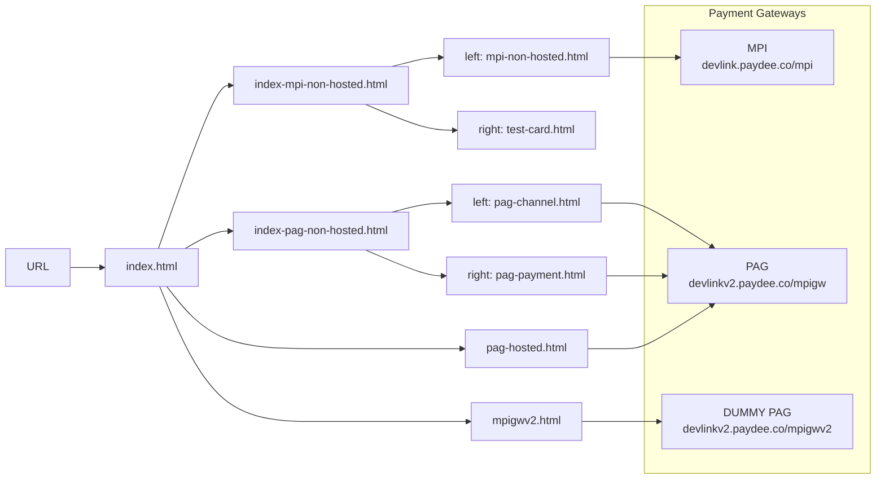
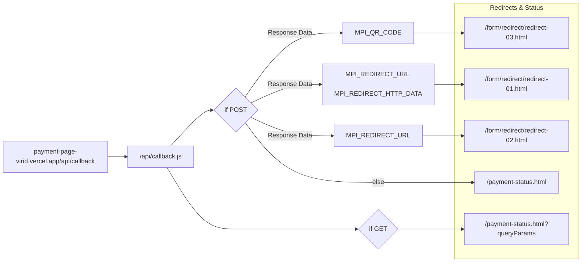

# Project Architecture
This documentation provides a visual overview of our payment UAT page.

## Flowchart Diagram
*The high-level navigation and iframe routing logic.*

## Response Flowchart Diagram
*The high-level navigation and iframe routing logic for response.*

